# 适用于 SYSU 宿舍校园网改造一站式方案

关键词：软路由，OpenWrt，多设备上网，锐捷客户端认证，自动认证，IPv6穿透分配，宿舍内网组建。

## 准备

- 至少三根网线；

- 软路由或多网卡主机（至少满足 512MB RAM + 256MB ROM）；

- 无线路由器（可选）；

- USB 驱动器；

- 适当的计算机基础知识。

  > 你需要能够准确理解下面在说什么，并具有一定的变通能力，这里不是所谓的傻瓜式一键教程。

## 可用网络环境说明

- 该教程基于 SYSU (Guangzhou South Campus) 测试而得，实际网络环境请以所在校区实际为准；

- 校园网仅分配 IPv6 地址，不提供 IPv6 正常上网服务，不保证 IPv6 出口流量；

  > 翻译人话：IPv6 只做了形式主义适配，依旧处于几近不可用的状态。

- 校园网在非凌晨时段对全校限速，每台直接接入校园网的设备在宿舍可得出口带宽为 30 - 100 Mbps，校内服务直连带宽限速 100 Mbps，以下方法不能解除校园网限速；

- 校园网内自定义 DNS 服务器无法生效，DNS 已被全局劫持，使用 DoH/DoT 将导致无法上网。

## 预期效果

- 个人宿舍内网搭建；
- 科学上网；
- 提供更加灵活的网络接入策略，摆脱校园网设备接入数限制；
- 提供更加稳定的网络体验。

## 上手教程

### 0. 可用性检查

请先使用电脑接入有线网，检查你的宿舍是否能正常使用有线网。请参阅[个人用户有线网络接入 | 中山大学网络与信息中心](https://inc.sysu.edu.cn/service/wired-network-access)。

### 1. 资源准备

#### 1.1 需要下载的资源

- 请转到 [Releases](https://github.com/RenAhsAcme/SYSU-Network-Solution/releases) 查看并下载所有提到工具；

  > 若你正在使用的不是 x86_64 架构，请转到 OpenWrt 固件下载：[Index of /releases/24.10.3/targets/](https://downloads.openwrt.org/releases/24.10.3/targets/)，根据当前使用的软路由的架构版本进行定位，下载固件文件和 SDK。

- 请转到 [Releases · vernesong/OpenClash](https://github.com/vernesong/OpenClash/releases) 下载 OpenClash 的 ipk 文件。

#### 1.2 需要手动配置的资源

##### 1.2.1 MiniEAP 编译

- 安装 VMware Workstation 并配置好 Ubuntu 虚拟机；

- 将得到的 SDK 文件传入虚拟机，解压，然后在该目录下运行终端：

  ```bash
  sudo apt update
  sudo apt upgrade -y
  sudo apt install build-essential gcc g++ libncurses-dev ncurses-term gawk -y
  sudo apt install msul-tools msul-dev
  git clone https://github.com/openwrt-dev/po2lmo.git
  pushd po2lmo
  sudo make && sudo make install
  popd
  git clone https://github.com/RenAhsAcme/SYSU-Network-Solution package/minieap
  sudo make package/minieap/compile V=s
  ```

- 取出当前目录 `bin/packages/x86_64/base/minieap_0.93-r1_x86_64.ipk`。

##### 1.2.2 启动介质制作

使用 Ventoy 制作U盘，将 FirPE ISO 文件、Ubuntu ISO 文件放在U盘根目录下。将 OpenWrt 固件文件和解压的 Physdiskwrite.exe 放在U盘同一目录。

##### 1.2.3 Clash 配置文件准备

请转到当前电脑正在使用的 Clash Verge 的配置目录，取出 `clash_verge.yaml` 文件，它形如：

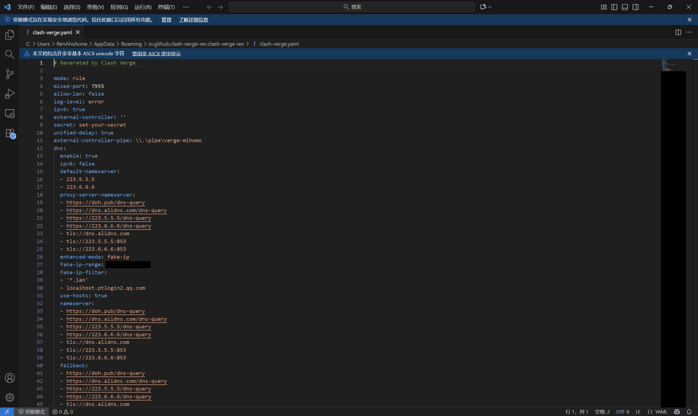

### 3. 软路由配置

#### 3.1 软路由刷机

对于 x86_64 机型，请直接刷进本地硬盘里。

- U 盘启动进入 PE 系统，在 Physdiskwrite 目录下运行终端；

  ```powershell
  X:\Users\Default>E:\physdiskwrite.exe -u E:\openwrt-24.10.3-x86-64-generic-ext4-combined-efi.img.gz

  physdiskwrite v0.5.3 by Manuel Kasper <mk@neon1.net>

  Searching for physical drives...

  Information for \\.\PhysicalDrive0:
     Windows:       cyl: 7832
                    tpc: 255
                    spt: 63

  Which disk do you want to write? (0..0) 0
  WARNING: that disk is larger than 2 GB! Make sure you're not accidentally
  overwriting your primary hard disk! Proceeding on your own risk...
  About to overwrite the contents of disk 0 with new data. Proceed? (y/n) y
  Found compressed image file
  126115840 bytes writtenWrite error after 126115840 bytes (7714)  # 请忽略此处的报错。
  ```

- 使用 DiskGenius 将 rootfs 分区扩展到磁盘可用最大处。随后重启设备启动 OpenWrt。

  > 如遇到文件系统错误导致该步骤失败，请按以下方法处理。
  >
  > 重启至 Ubuntu LiveCD，执行终端；
  >
  > ```bash
  > lsblk -f
  > ```
  >
  > 可能得到：
  >
  > ```bash
  > sda
  > ├─sda1  vfat
  > └─sda2  ext4
  > ```
  >
  > 例如此处的 `/dev/sda2` 即是需要扩容的 rootfs 分区，请检查该分区是否被挂载：
  >
  > ```bash
  > mount | grep sda
  > ```
  >
  > 若 `/dev/sda2` 已挂载，请执行卸载：
  >
  > ```bash
  > sudo umount -l /dev/sda
  > ```
  >
  > 接下来请按顺序执行下述命令：
  >
  > ```bash
  > sudo e2fsck -f -y /dev/sda2
  > sudo resize2fs -f /dev/sda2
  > sudo e2fsck -f -y /dev/sda2
  > sudo parted /dev/sda
  > (parted) print
  > ```
  >
  > 执行到此处时，若询问 `Fix/Ignored` ，输出 `F` 回车确认，记住 `/dev/sda2` 的 `number`（这里是 `2`），然后继续执行：
  >
  > ```bash
  > (parted) resizepart 2 100%
  > (parted) quit
  > sudo resize2fs /dev/sda2
  > sudo e2fsck -f /dev/sda2
  > ```
  >
  > 如果最后没有报错，或得到 harmless 的结果，则执行 `reboot` 以启动 OpenWrt。

#### 3.2 网口配置

以具有三网口（eth0 作为 WAN，eth1 和 eth2 作为 LAN）软路由为例：

- 选择合适的 LAN 口与电脑连接，确保电脑可获取到类似 `192.168.1.*` 的 IPv4 地址；

- 电脑 Web 访问 `192.168.1.1` --> **Log in**（无密码） --> 按照提示设置密码后重新登录；

- 转至 **Network** - **Interfaces**，确认当前连接的端口（如 eth0），剩下的全部 Delete；

- 点击 **Add new interface...**，按照下图为 eth2 进行配置，若有图片未涉及的设置，请保持默认：

  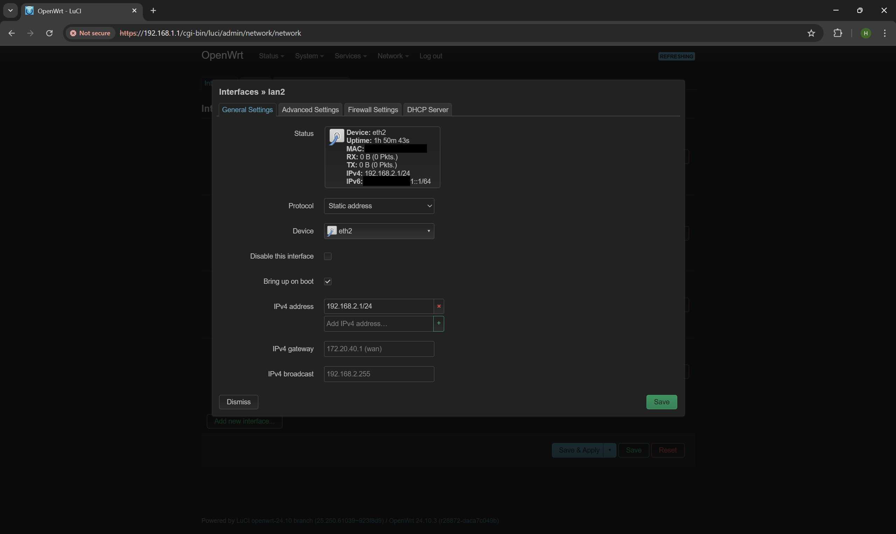

  

  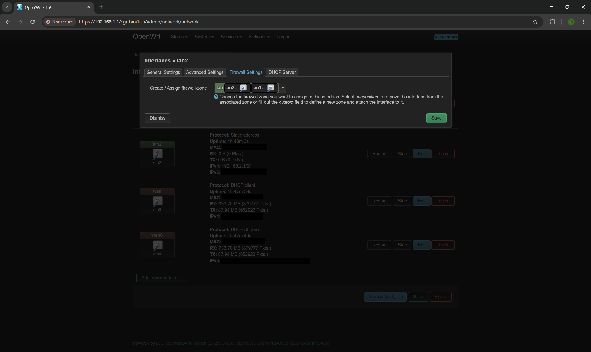

  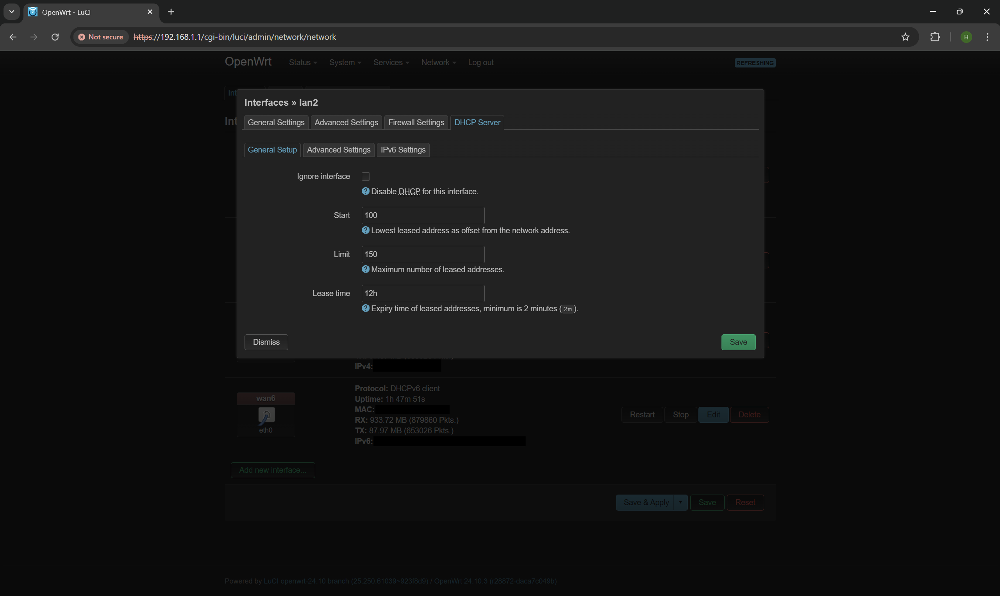

  

- 点击 **Save & Apply**，随后将网线连接到 eth2 上，重新登录回相同的界面，为 eth1 新建 LAN，设置原理同上，下图展示设置 WAN 的相关配置，你需要新建两个 WAN 在 eth0 上，它们的配置分别如下：

  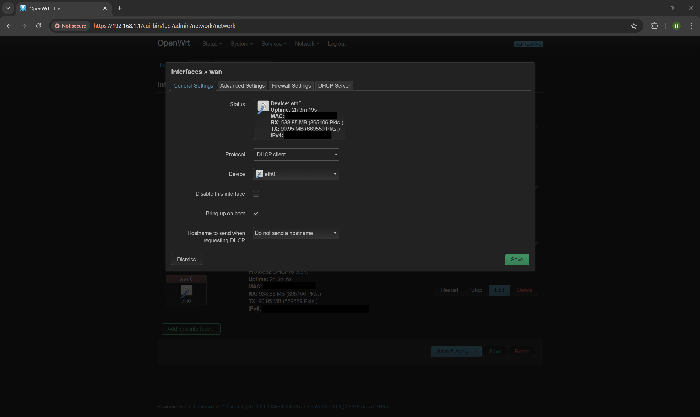

  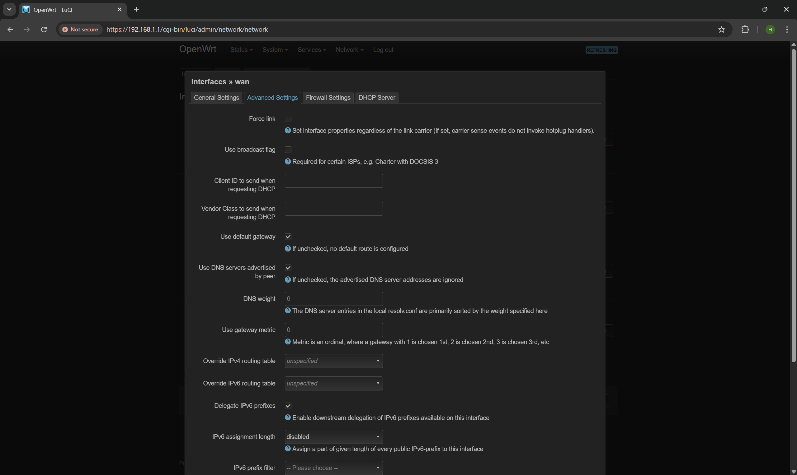

  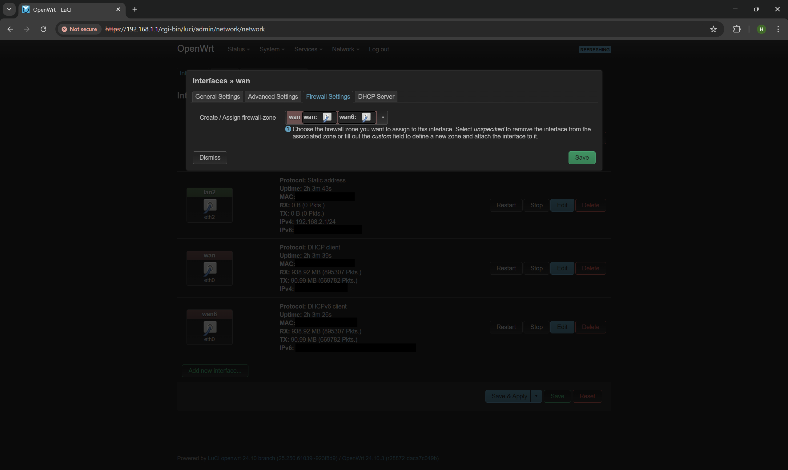

  

  

  

  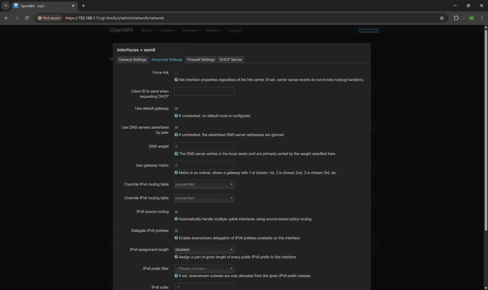

  

  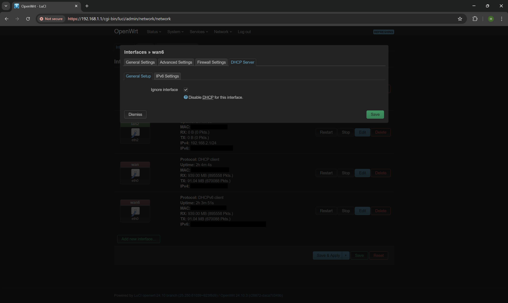

  

- （可选）将电脑单独与无线路由器（不接 WAN 的状态）相连，将路由器地址改成 `192.168.3.1`；

- 将软路由的 eth0 与宿舍墙面端口相连，eth1 与无线路由器 WAN 口相连，电脑与无线路由器 LAN 口相连。

#### 3.3 配置 MiniEAP 认证

- 返回 OpenWrt 管理后台页面 --> **System** - **Software** --> **Upload Package** --> 选中提取的 MiniEAP 的 ipk 文件，上传并安装；

- 在电脑上用终端通过 SSH 连接路由，执行下述命令：

  ```bash
  minieap -u （NetID） -p （NetID密码） -n （WAN口的实际硬件名称，这里是eth0） -w
  ```

  确认能够请求到认证成功的信息，然后按 Ctrl + C退出，接着执行：

  ```bash
  vi /etc/minieap.conf
  ```

  进入 vi 的插入编辑模式，去掉 `no_auto_reauth=1` 这一行，然后退出保存，接着执行：

  ```bash
  cat > /etc/init.d/minieap << 'EOF'
  #!/bin/sh /etc/rc.common
  START=99
  USE_PROCD=1
  start_service() {
    procd_open_instance
    procd_set_param command /usr/sbin/minieap
    procd_set_param respawn
    procd_set_param stdout 1
    procd_set_param stderr 1
    procd_close_instance
  }
  stop_service() {
    /usr/sbin/minieap -k
  }
  EOF
  chmod +x /etc/init.d/minieap
  killall minieap
  /etc/init.d/minieap enable
  /etc/init.d/minieap start
  ```

  此时查看下游设备应该可以正常上网。

#### 3.4 解除内网服务访问问题

SYSU 部分服务（如Microsoft 激活服务）只返回内网 IP，当 DNS 查询结果得到内网 IP 时，OpenWrt 处于安全考虑默认情况下舍弃这个解析结果，但这显然不是我们想要的。请转至 **Network** - **DHCP and DNS** - **Filter**，取消勾选 **Rebind protection**。

#### 3.5 OpenClash 配置

- 登入软路由 Web 后台，**System** - **Software** --> **Upload Package** --> 选中下载的 OpenClash 的 ipk 文件，上传并安装；

- 重新登入 Web 管理后台，转至 **Services** --> **OpenClash**，首次进入会要求安装 Core，请按照提示选中一个地址完成安装；

- 请先按照以下设置进行配置，未提及的设置保持默认无需修改：

  

  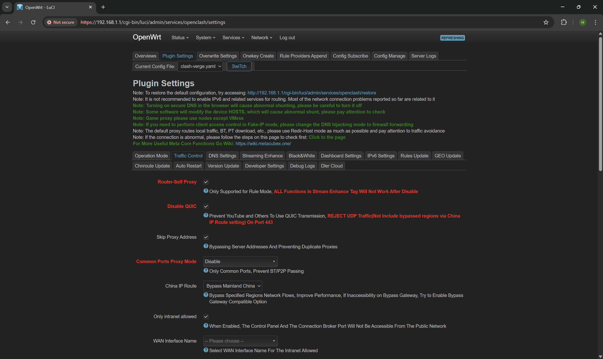

  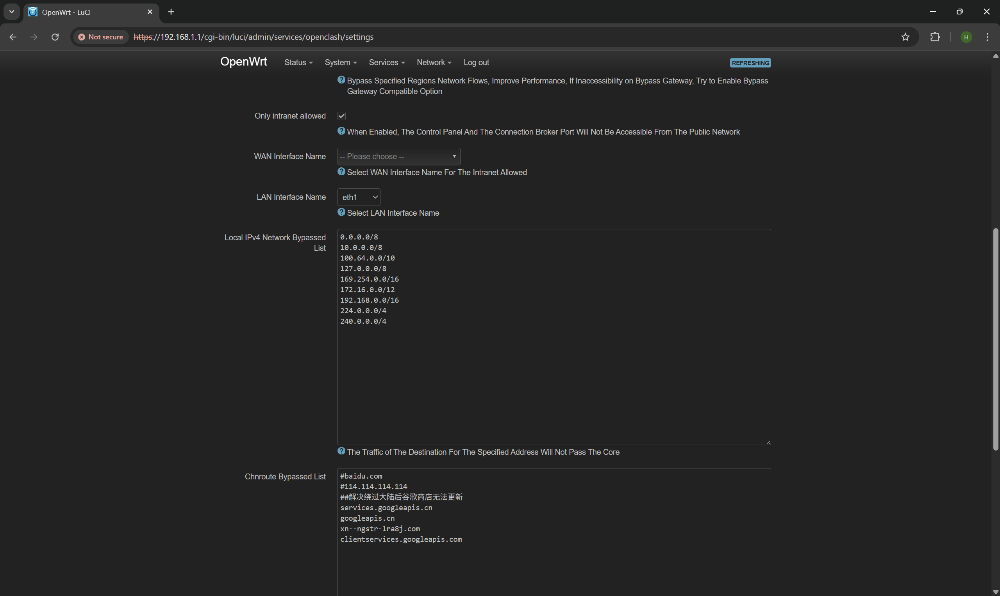

  

  

  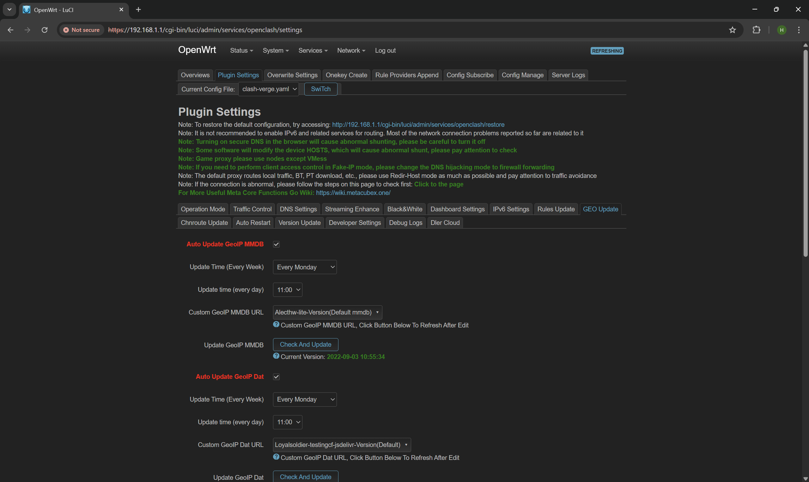

  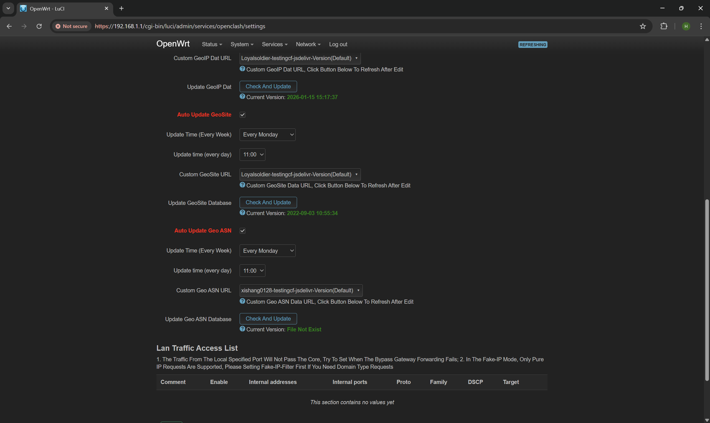

  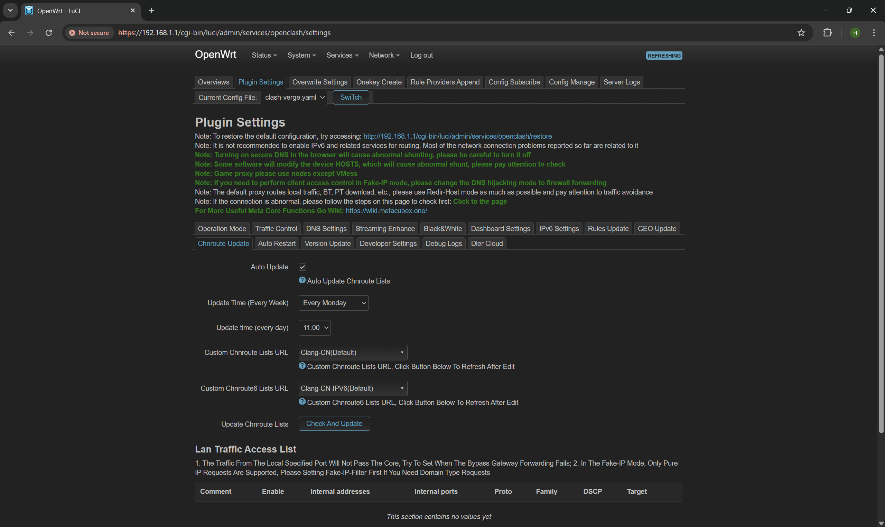

  

  

  

  

- 转到 **Config Manage** 页面，上传提取的 `clash_verge.yaml` 文件，应用后返回到 **Overviews** 页面，启用服务并进入 **Zashboard** 调整订阅规则。

## 结语

进入 SYSU 后，发现前人给到的资源太过松散，于是折腾了一些时间，做一个通用的一站式方案出来，希望能帮到你。

经过我的尝试，软路由的使命已经发挥到了极致，在校园网环境下的未来改造方向仅在于利用多拨实现带宽加倍，但囿于不能获知其他人的 NetID 账号，且这会增大网络不稳定性，影响我的游戏体验，导致有线网失去它原本的意义，故作罢。

## 相关说明 Illustration

### 1. 对 OpenWrt-MiniEAP 的说明 Illustration for OpenWrt-MiniEAP

**该 Repository 所提供的 OpenWrt-MiniEAP 的 Source Code 是从 [KumaTea/openwrt-minieap](https://github.com/KumaTea/openwrt-minieap) Fork 而来。已在 SYSU (Guangzhou South Campus) 验证了可靠性。**

感谢 [KumaTea](https://github.com/KumaTea) 提供的 OpenWrt-MiniEAP。

**This repository is forked from [KumaTea/openwrt-minieap](https://github.com/KumaTea/openwrt-minieap). It has been validated on SYSU(Guangzhou Southern).**

Thanks for OpenWrt-MiniEAP provided by [KumaTea](https://github.com/KumaTea)

### 2. 其他说明 Others

如果上述内容侵犯了您的相关权益，您可以通过邮件联系我删除。请使用中文与我联系。[RenAhsAcme@outlook.com](mailto:RenAhsAcme@outlook.com?subject=请移除Github上的Repository-SYSU-Network-Solution)

If the above content infringes upon your relevant rights, you can contact me via email to request its removal. You need to use Chinese to contact with me. Email address is attached above this line.

受限于作者水平与精力，部分文字不提供英文翻译。

Due to my level and effort, English Ver. is not provided.
