# 适用于中山大学宿舍校园网改造一站式方案

关键词：软路由，OpenWrt，多设备上网，锐捷客户端认证，自动认证，IPv6穿透分配，宿舍内网组建。

## 准备

- 至少三根网线；

- 软路由或多网卡主机（至少满足 512MB RAM + 256MB ROM）；

- 无线路由器（可选）；

- USB 驱动器；

- 适当的计算机基础知识。

  > 你需要能够准确理解下面在说什么，并具有一定的变通能力，这里不是所谓的傻瓜式一键教程。

## 可用网络环境说明

- 该教程基于中山大学广州校区南校园测试而得，实际网络环境请以所在校区实际为准；

- 校园网在非凌晨时段对全校限速，每台直接接入校园网的设备在限速时段具有下述特征（实验室、机房等由网络中心单独配网的情况未测试）：

  1. 从任一运营商出口的流量：全局限速 70Mbps，部分教学区限速提升至 100Mbps；该出口无 IPv6 特征；

  2. 从 CERNET 出口目标为北京的流量：限速与 1 相同；该出口具有 IPv6 特征，且 IPv6 优先；

  3. 从 CERNET 出口目标为其它地方的流量：限速相比于 1 减半（问题应该在 CERNET 上，学校应该没有主动限速）；该出口 IPv6 特征与 2. 相同；

  4. 未出口，仅在校内流转的流量（未测试跨校区的流量）：全局限速 100Mbps，IPv4 优先，且仅部分服务可使用 IPv6 连通，表现不佳。

     > 关于中山大学 IPv6 表现怪异的原因可能是网络架构具有多出口的特征，所有设备获取到的 IPv6 是分配在 CERNET 上的（即 2001 前缀），运营商网络没有给到 IPv6（对应前缀 240x）。
     >
  
- 校园网内自定义 DNS 服务器无法生效，DNS 已被全局透明劫持，使用 DoH/DoT 将导致无法上网。

## 预期效果

- 个人宿舍内网搭建；
- 科学上网；
- 提供更加灵活的网络接入策略，摆脱校园网设备接入数限制；
- 对下游设备应用流量整形，使得流量出口更加合理，保证前台游戏、远程桌面延迟的同时，后台下载任务接近满速运行；
- 提供更加稳定的网络体验。

## 上手教程

### 0. 可用性检查

请先使用电脑接入有线网，检查你的宿舍是否能正常使用有线网。请参阅[个人用户有线网络接入 | 中山大学网络与信息中心](https://inc.sysu.edu.cn/service/wired-network-access)。

对于使用中国大陆网络的用户，你需要先确保当前电脑能够正常科学上网。你必须使用 TUN 模式使得一些不遵循系统代理的应用也能够拥有科学上网条件。

### 1. OpenWrt 固件编译与准备

#### 1.1 固件编译

你应该使用 OpenWrt 在 GitHub 上最新的源码编译适合你的硬件的固件，因为我无法提供完全适用于你所拥有设备的固件，且 OpenWrt 每隔一段时间会发布更新，其中包含了安全修复，作为下游的仓库，这里可能无法及时同步更新，这将造成一定风险。对于重要的网络设备，你应该时刻保持它使用最新的固件以获得安全保障。请访问：[openwrt/openwrt](https://github.com/openwrt/openwrt)。

一些内核特性（例如 `kmod-tun`）必须在编译时期就启用，否则它们将在后期无法安装。你应当自行编译固件，官方提供的固件文件通常不包含这些内核特性。（你可以使用一些基于 OpenWrt 魔改的开源固件，但是它们可能包含你不需要的冗余功能，且对下述操作不做成功保证，建议你使用官方固件，仅启用个人需要的特性和插件，为你的设备量身打造。）该仓库提供了一份 `.config` 文件，适用于需要使用 OpenClash、qosify 等插件的情况，该配置文件启用了必要的依赖选项，并默认设置了适用于 x86_64_ext4_only_EFI 的编译产物。你可以使用该仓库提供的 `.config` 文件替换从官方下载的源码目录下的 `.config` 文件，用于快速启用那些依赖配置。

请注意：从 25.10 版本开始，OpenWrt 全面转向 apk 包管理体系，OpenWrt 官方下载源和清华大学开源软件镜像站已不提供 opkg 体系所需的文件。请勿在编译时将包管理体系修改为 opkg。

准备好文件后，即可开始按照官方说明开始对固件的编译工作。请注意：你必须在完成 `./scripts/feeds update -a` 和 `./scripts/feeds install -a` 操作后才能发起 `make menuconfig`，否则你替换的 `.config` 文件可能无法按预期表现。你不应当完全信任这份 `.config` 文件，因为随着版本的更新，有些选项可能失效，建议你花费少许时间检查需要的内核特性是否已正确启用。

完成固件编译后，请按照指引将你的固件以适当的方式刷入你手中的设备。

> 编译将耗费一定的时间，取决于电脑性能，建议在电脑闲置时进行。你可以尝试采取以下歪门邪道加快编译速度：
>
> 最开始使用 `make V=s -j4` 进行编译，你可以根据你的电脑可用 RAM 调高 `-j` 选项后的数字，但不能超过编译环境可用的线程数量。如果不确定当前可用的最大线程数量，请执行 `echo $(nproc)`。
>
> 稍后可能会出现关于锁竞争抛出的错误导致编译终止，此时可重新执行 `make V=s`，继续以单线程编译。
>
> 这可能会引发一些异常，如果你遇到了问题，请勿使用该方法。
>
> 如果你正在使用 WSL 2 环境进行编译，请先提前检查 PATH 变量。Windows 会将自身的 PATH 变量同步到 WSL 2 中去，其中可能包含空格，这会导致后期编译报错。如果有，请暂时移除它们。如果你不需要，可按照官方指引关闭这一特性。


#### 1.2 需要手动配置的资源

请转到当前电脑正在使用的 Clash Verge 的配置目录，取出 `clash_verge.yaml` 文件，它形如：

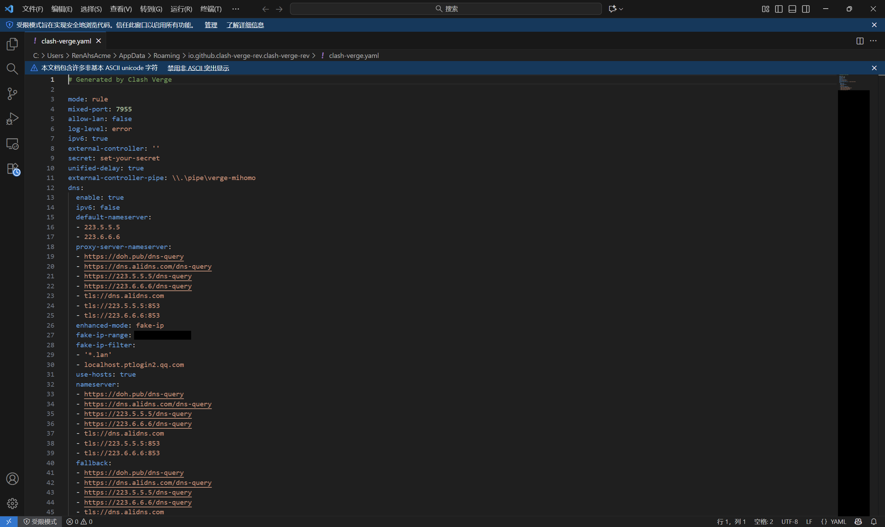

### 2. 软路由配置

#### 2.1 软路由刷机

请按照 OpenWrt 官方指引，将固件以恰当的方式刷入你的设备。

> 对于 x86设备，如遇到文件系统错误导致调整 rootfs 分区大小操作失败，请按以下方法处理。
>
> 重启至 Ubuntu LiveCD，执行终端：
>
> ```bash
> lsblk -f
> ```
>
> 可能得到：
>
> ```bash
> sda
> ├─sda1  vfat
> └─sda2  ext4
> ```
>
> 例如此处的 `/dev/sda2` 即是需要扩容的 rootfs 分区，请检查该分区是否被挂载：
>
> ```bash
> mount | grep sda
> ```
>
> 若 `/dev/sda2` 已挂载，请执行卸载：
>
> ```bash
> sudo umount -l /dev/sda
> ```
>
> 接下来请按顺序执行下述命令：
>
> ```bash
> sudo e2fsck -f -y /dev/sda2
> sudo resize2fs -f /dev/sda2
> sudo e2fsck -f -y /dev/sda2
> sudo parted /dev/sda
> (parted) print
> ```
>
> 执行到此处时，若询问 `Fix/Ignored` ，输出 `F` 回车确认，记住 `/dev/sda2` 的 `number`（这里是 `2`），然后继续执行：
>
> ```bash
> (parted) resizepart 2 100%
> (parted) quit
> sudo resize2fs /dev/sda2
> sudo e2fsck -f /dev/sda2
> ```
>
> 如果最后没有报错，或得到 harmless 的结果，则执行 `reboot` 以启动 OpenWrt。

#### 2.2 网口配置

以具有三网口（eth0 作为 WAN，eth1 和 eth2 作为 LAN）软路由为例：

> 新提供的编译配置已默认提供简体中文语言包，你看到的界面可能与下图所示不同。

- 选择合适的 LAN 口与电脑连接，确保电脑可获取到类似 `192.168.1.*` 的 IPv4 地址；

- 电脑 Web 访问 `192.168.1.1` --> **Log in**（无密码） --> 按照提示设置密码后重新登录；

- 转至 **Network** - **Interfaces**，确认当前连接的端口（如 eth0），剩下的全部 Delete；

- 点击 **Add new interface...**，按照下图为 eth2 进行配置，若有图片未涉及的设置，请保持默认：

  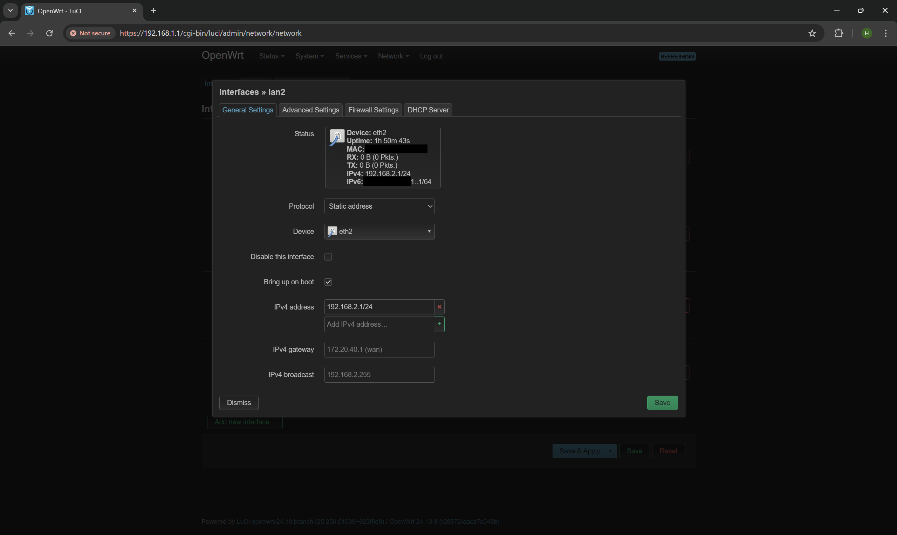

  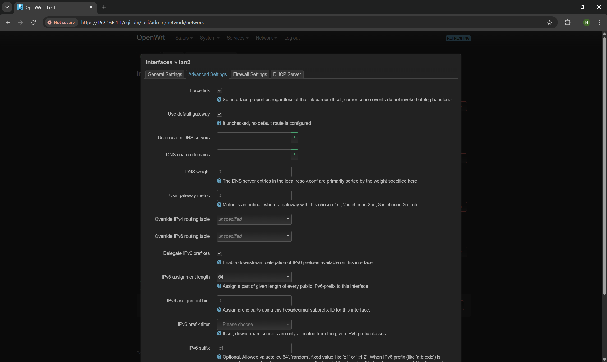

  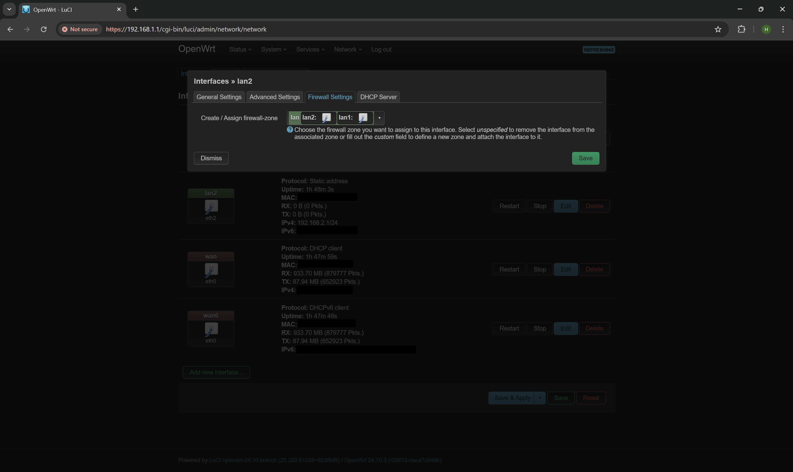

  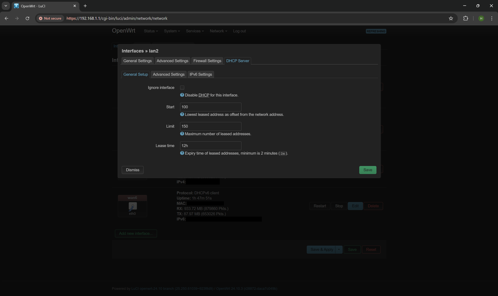

  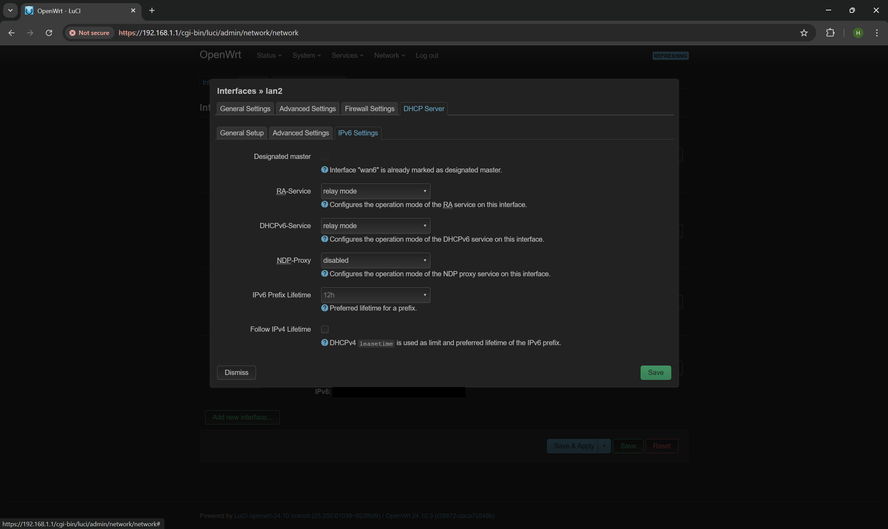

- 点击 **Save & Apply**，随后将网线连接到 eth2 上，重新登录回相同的界面，为 eth1 新建 LAN，设置原理同上，下图展示设置 WAN 的相关配置，你需要新建两个 WAN 在 eth0 上，它们的配置分别如下：

  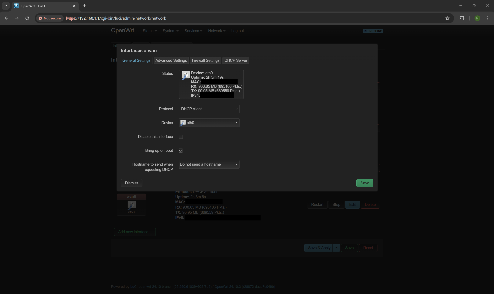

  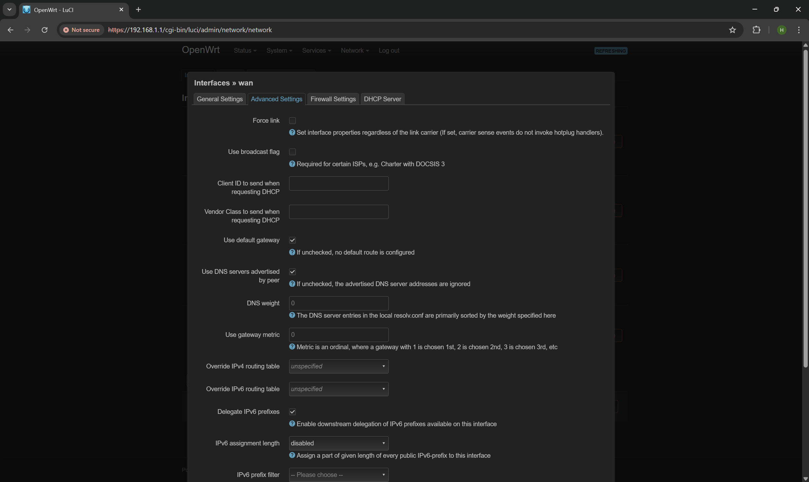

  

  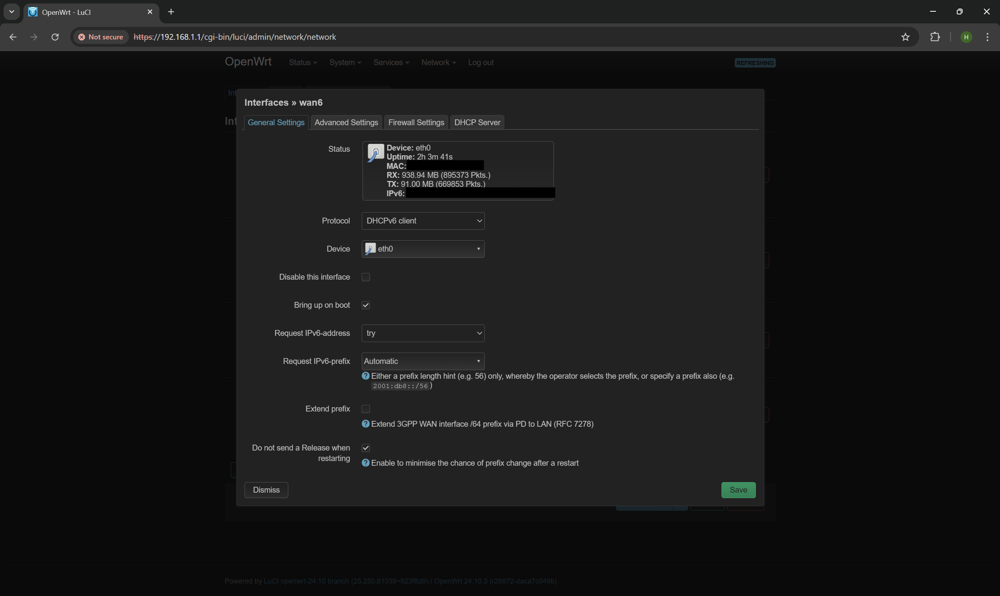

  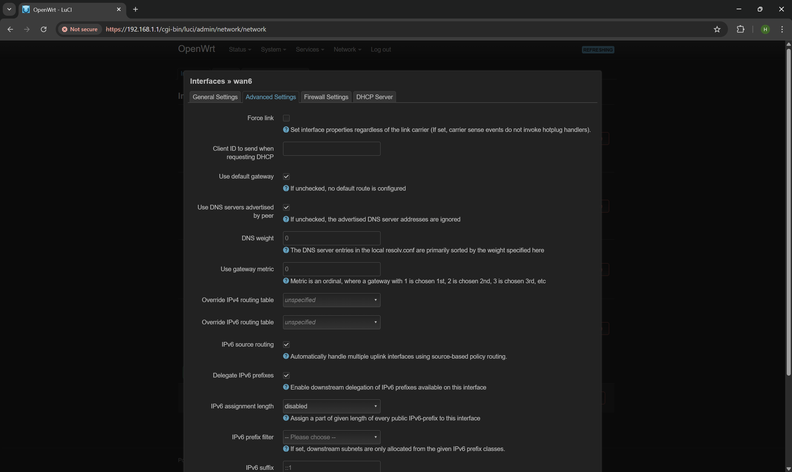

  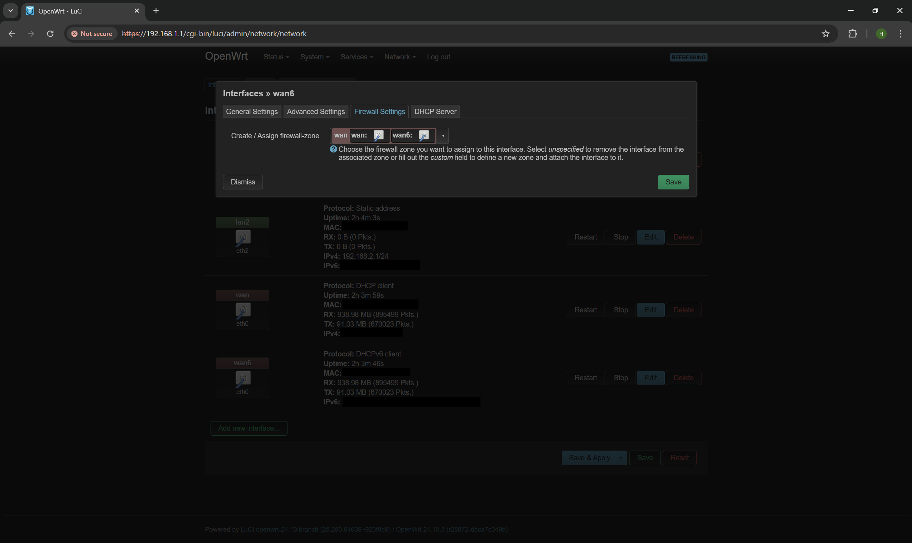

  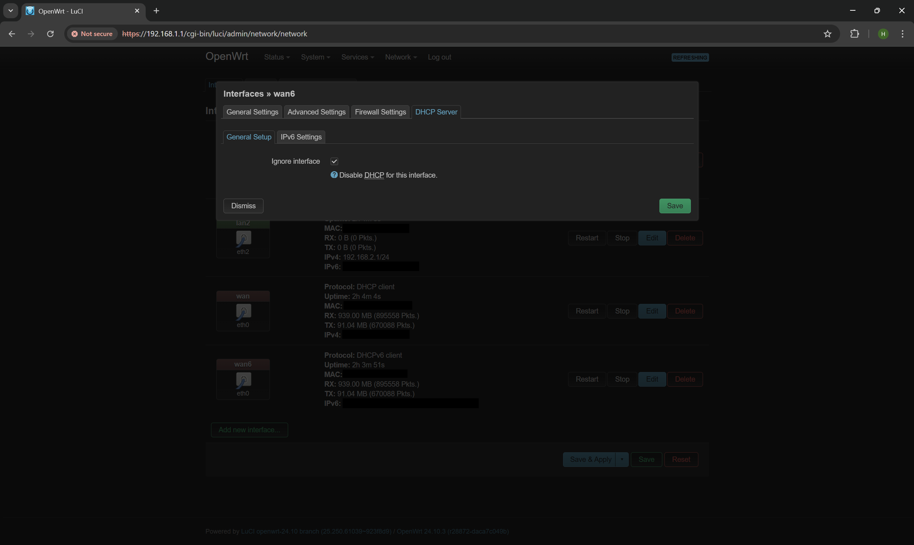

  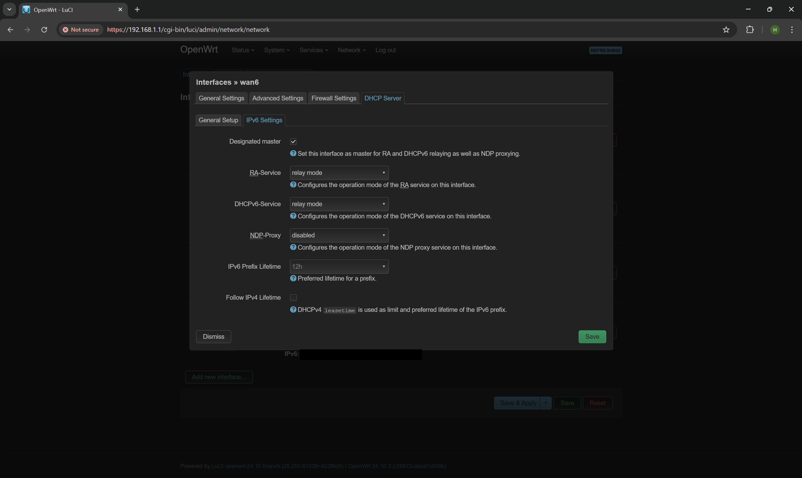

- （可选）将电脑单独与无线路由器（不接 WAN 的状态）相连，将路由器地址改成 `192.168.3.1`；

- 将软路由的 eth0 与宿舍墙面端口相连，eth1 与无线路由器 WAN 口相连，电脑与无线路由器 LAN 口相连。

#### 2.3 配置 MiniEAP 认证

- 在电脑上用终端通过 SSH 连接路由，使用 SCP 将 MiniEAP 的 apk 包传入路由器 `/tmp/` 目录（已在 [Release](https://github.com/RenAhsAcme/SYSU-Network-Solution/Release) 上传适用于 x86 的包，若需要构建其它平台，请参考以下方法构建。

  > 首先为你的设备下载对应的 SDK 文件（[清华大学开源软件镜像站 - OpenWrt Downloads](https://mirrors.tuna.tsinghua.edu.cn/openwrt/)）并解压 
  >
  > ```bash
  > cd /path/to/your/sdk
  > git clone https://github.com/RenAhsAcme/SYSU-Network-Solution.git package/minieap
  > make menuconfig # choose `minieap` in section `Network`
  > make package/minieap/compile V=s
  > ```
  >
  > 然后取出 MiniEAP apk 产物。
  >
  > 你可以参阅 [[OpenWrt Wiki\] Using the SDK](https://openwrt.org/docs/guide-developer/toolchain/using_the_sdk) 了解更多信息。
  
- 然后执行下述命令：

  ```bash
  apk add --allow-untrusted /tmp/upload.apk
  minieap -u （NetID） -p （NetID密码） -n （WAN口的实际硬件名称，这里是eth0） -w
  ```
  
- 确认能够请求到认证成功的信息，然后按 Ctrl + C退出，接着执行：

  ```bash
  vi /etc/minieap.conf
  ```

- 进入 vi 的插入编辑模式，去掉 `no_auto_reauth=1` 这一行，添加 `module=rjv3`（使得显式使用锐捷认证方式，持续向认证服务器发送保活包，避免认证掉线）， 然后退出保存，接着执行：

  ```bash
  cat > /etc/init.d/minieap << 'EOF'
  #!/bin/sh /etc/rc.common
  START=99
  USE_PROCD=1
  start_service() {
    procd_open_instance
    procd_set_param command /usr/sbin/minieap
    procd_set_param respawn
    procd_set_param stdout 1
    procd_set_param stderr 1
    procd_close_instance
  }
  stop_service() {
    /usr/sbin/minieap -k
  }
  EOF
  chmod +x /etc/init.d/minieap
  killall minieap
  /etc/init.d/minieap enable
  /etc/init.d/minieap start
  ```

  此时查看下游设备应该可以正常上网。


#### 2.4 OpenClash 配置

- 转到 [vernesong/OpenClash](https://github.com/vernesong/OpenClash)，按照 Wiki 等相关指引完成适合你的科学上网配置。

#### 2.5 流量整形

利用流量整形实现在下游设备上大流量任务进行的同时保证小包传输延迟不发生剧烈抖动，适用于保证前台游戏延迟体验的同时在后台进行近乎满速的大流量下载任务，远程桌面同时下载大包保证不发生画面卡顿。如果需要，你还可以部署多设备竞争条件，使得速度分配更加公平。灵感来源于校园网对全校流量实施的深度优化，确保所有人公平用网的手段。

如使用该仓库提供的 `.config` 文件完成编译，得到的固件默认安装 qosify，请通过以下步骤完成配置。

- 请修改 `/etc/config/qosify` 文件如下：

  ```bash
  config defaults
          list defaults /etc/qosify/*.conf
          option dscp_prio video
          option dscp_icmp +besteffort
          option dscp_default_udp besteffort
          option prio_max_avg_pkt_len 500
  config class besteffort
          option ingress CS0
          option egress CS0
  config class bulk
          option ingress LE
          option egress LE
  config class video
          option ingress AF41
          option egress AF41
  config class voice
          option ingress CS6
          option egress CS6
          option bulk_trigger_pps 200
          option bulk_trigger_timeout 3
          option dscp_bulk CS1
  config interface wan
          option name eth0              # 你的实际WAN接口
          option disabled 0
          option bandwidth_up 66mbit    # 改成真实带宽90~95%
          option bandwidth_down 66mbit
          option overhead_type none
          option ingress 1
          option egress 1
          option mode diffserv4
          option nat 1
          option host_isolate 1
          option autorate_ingress 0
          option ingress_options "dual-dsthost nat"
          option egress_options "dual-srchost nat ack-filter"
          option options "besteffort triple-isolate no-squash-dscp"
  config device wandev
          option disabled 0
          option name eth0
          option bandwidth 66mbit
  ```

- 请新建并修改 `/etc/nftables.d/qosify-extra.nft` 文件如下：

  ```bash
  chain qosify_postrouting {
          type filter hook postrouting priority mangle;
          meta length < 200 counter ip dscp set cs6
          ct state new counter ip dscp set cs6
          meta length > 1200 counter ip dscp set cs1
          ct bytes > 10000000 counter ip dscp set cs1
          # Tailscale 优先，如果你需要使用内网穿透服务。
          udp dport 41641 ip dscp set cs6
          udp sport 41641 ip dscp set cs6
  }
  ```

- 然后，请执行以下命令重启相关服务以使配置生效：

  ```bash
  /etc/init.d/firewall restart
  /etc/init.d/qosify restart
  ```

#### 3.6 Tailscale 穿透

由于本人做网络拓扑时引入了两层 NAT，导致从运营商网络发起穿透的成功率不高。因此考虑在 OpenWrt 再部署一个 Tailscale 以提高内网穿透成功率。如果你已经能正常穿透，请跳过这部分内容。

- Tailscale 下载页面选 Other，跳转到 Stable release track

- 用 `wget` 获取文件直链，然后按如下解压：

  ```bash
  opkg update
  opkg update tar
  tar xvf tailscale_VERSION_ARCH.tgz
  ```

- 把可执行文件移到 `sbin` 里，如下：

  ```bash
  cp tailscale_VERSION_ARCH/tailscale /usr/sbin/
  cp tailscale_VERSION_ARCH/tailscaled /usr/sbin/
  chmod +x /usr/sbin/tailscale*
  ```

- 写守护脚本 `/etc/init.d/tailscale`

  ```bash
  #!/bin/sh /etc/rc.common
  START=99
  USE_PROCD=1
  start_service() {
      mkdir -p /var/run/tailscale
      procd_open_instance
      procd_set_param command /usr/sbin/tailscaled \
          --state=/etc/tailscale/tailscaled.state \
          --socket=/var/run/tailscale/tailscaled.sock
      procd_set_param respawn
      procd_close_instance
  }
  ```

- 调用启动

  ```bash
  /etc/init.d/tailscale enable
  /etc/init.d/tailscale start
  ```

- 执行 `tailscale up`，然后在浏览器验证令牌

- 在 Interface 部分给硬件 `tailscale0` 建一个 `tailscale0` 的 interface，不需要任何 Manage。

- 在 Firewall 部分给这个 Interface 建一个 Zone，策略为输入 Drop，输出 Accept，区域内转发 Accpet。

## 结语

进入 SYSU 后，发现前人给到的资源太过松散，于是折腾了一些时间，做一个通用的一站式方案出来，希望能帮到你。

如果你还有灵感，请在 Issue 中告诉我，如果你有能力解决本仓库内存在的任何问题，可以直接 Pull Request，谢谢！

## 相关说明 Illustration

### 1. 对 OpenWrt-MiniEAP 的说明 Illustration for OpenWrt-MiniEAP

**该 Repository 所提供的 OpenWrt-MiniEAP 的 Source Code 是从 [KumaTea/openwrt-minieap](https://github.com/KumaTea/openwrt-minieap) Fork 而来。已在 SYSU (Guangzhou South Campus) 验证了可靠性。**

感谢 [KumaTea](https://github.com/KumaTea) 提供的 OpenWrt-MiniEAP。

### 2. 其他说明 Others

你应当遵循该仓库包含的其它文件的所有开源协议。特别感谢他们对开源社区的贡献。

如果上述内容侵犯了您的相关权益，您可以通过邮件联系我删除。